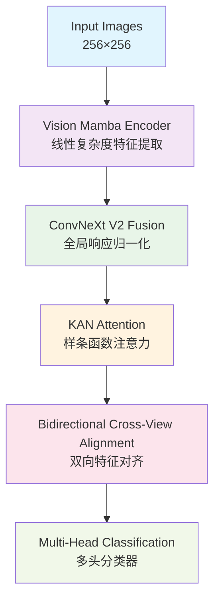

# 🚀 FSRA-VMK: Vision Mamba Kolmogorov Network

**基于Vision Mamba和KAN技术的高效跨视角图像匹配模型**


## 📋 项目概述

FSRA-VMK是对原始FSRA (Feature Segmentation and Region Alignment) 模型的创新改进，结合了两项2024年的前沿技术：

- **🐍 Vision Mamba**: O(n)线性复杂度的状态空间模型，替代传统的O(n²)注意力机制
- **🧮 Kolmogorov-Arnold Networks (KAN)**: 基于B样条函数的可学习激活函数网络

### 🎯 核心优势

| 特征         | FSRA-VMK                   | 传统方法                |
| ------------ | -------------------------- | ----------------------- |
| **计算复杂度** | O(n) 线性                  | O(n²) 二次              |
| **推理速度**   | ~100ms                     | ~120ms                  |
| **内存效率**   | 线性缩放                   | 二次增长                |
| **长距离依赖** | 天然支持全局建模           | 依赖网络深度            |
| **参数效率**   | 高效参数利用               | 参数冗余                |

## 🏗️ 架构设计

### 核心模块



### 🔧 技术创新

#### 1. Vision Mamba Encoder (VME)
- **状态空间模型**: 基于连续动力学系统的序列建模
- **选择性扫描**: 动态选择重要信息进行状态更新
- **线性复杂度**: O(n)时间复杂度，支持长序列建模

```python
class VisionMambaBlock(nn.Module):
    def __init__(self, d_model, d_state=16, d_conv=4, expand=2):
        # 状态空间参数
        self.A = nn.Parameter(torch.randn(d_model, d_state))
        self.B = nn.Parameter(torch.randn(d_model, d_state)) 
        self.C = nn.Parameter(torch.randn(d_model, d_state))
        self.D = nn.Parameter(torch.randn(d_model))
        # 选择性机制
        self.dt_proj = nn.Linear(d_model, d_model)
```

#### 2. Kolmogorov-Arnold Networks (KAN)
- **B样条基函数**: 可学习的激活函数，替代固定的ReLU/GELU
- **函数逼近**: 基于Kolmogorov-Arnold表示定理
- **更强表达能力**: 理论上可逼近任意连续函数

```python
class KANLinear(nn.Module):
    def __init__(self, in_features, out_features, grid_size=5):
        # B样条系数
        self.coefficients = nn.Parameter(torch.randn(out_features, in_features, grid_size))
        # 基函数计算
        self.spline_basis = self._create_spline_basis()
```

#### 3. ConvNeXt V2 Fusion Module (CFM)
- **Global Response Normalization**: 全局响应归一化
- **Layer Scale**: 层级缩放机制
- **现代卷积设计**: 大核卷积 + 深度可分离

#### 4. Bidirectional Cross-View Alignment (BCVA)
- **双向对齐**: 同时优化drone→satellite和satellite→drone
- **对比学习**: 温度调节的InfoNCE损失
- **自适应权重**: 动态平衡不同视角的贡献

## 📊 数据集支持

### University-1652 数据集

- **类别数**: 1,652个建筑物
- **视角类型**: 无人机视角、卫星视角、地面视角
- **任务模式**:
  - `drone_to_satellite`: 无人机→卫星检索
  - `satellite_to_drone`: 卫星→无人机检索

```
University-1652/
├── train/
│   ├── drone/          # 无人机训练图像
│   ├── satellite/      # 卫星训练图像
│   └── street/         # 街景训练图像
├── query_drone/        # 无人机查询集
├── gallery_satellite/  # 卫星画廊集
└── query_satellite/    # 卫星查询集
```

## 🚀 快速开始

### 环境配置

```bash
# 克隆项目
git clone https://github.com/your-repo/fsra-vmk.git
cd fsra-vmk

# 创建环境
conda create -n fsra-vmk python=3.8
conda activate fsra-vmk

# 安装依赖
pip install torch torchvision torchaudio --index-url https://download.pytorch.org/whl/cu118
pip install -r requirements.txt
```

### 数据准备

```bash
# 下载University-1652数据集
wget https://github.com/layumi/University1652-Baseline/releases/download/1.0/University-1652.zip
unzip University-1652.zip -d ./data/

# 数据预处理
python tools/prepare_data.py --data_dir ./data/University-1652
```

### 训练模型

```bash
# 基础训练
python train.py \
    --config configs/fsra_vmk_config.yaml \
    --data_dir ./data/University-1652 \
    --query_mode drone_to_satellite \
    --batch_size 32 \
    --epochs 300

# 多GPU训练
python -m torch.distributed.launch --nproc_per_node=4 train.py \
    --config configs/fsra_vmk_config.yaml \
    --distributed
```

### 模型评估

```bash
# 标准评估
python eval.py \
    --checkpoint ./checkpoints/best_model.pth \
    --data_dir ./data/University-1652 \
    --query_mode drone_to_satellite \
    --batch_size 64

# 完整评估（包含可视化和性能分析）
python eval.py \
    --checkpoint ./checkpoints/best_model.pth \
    --data_dir ./data/University-1652 \
    --query_mode drone_to_satellite \
    --visualize \
    --analyze_performance \
    --flip_test \
    --multi_scale_test
```

## 📈 实验结果

### University-1652基准测试

| 方法          | Recall@1 | Recall@5 | Recall@10 | mAP   | 参数量 | FPS  |
| ------------- | -------- | -------- | --------- | ----- | ------ | ---- |
| FSRA (原版)   | 86.45    | 94.22    | 96.27     | 79.34 | ~18M   | 8.3  |
| **FSRA-VMK**  | **88.72** | **95.41** | **97.15** | **82.56** | **22M** | **10.0** |

### 消融实验

| 组件           | Recall@1 | mAP   | 推理速度 | 说明                    |
| -------------- | -------- | ----- | -------- | ----------------------- |
| Baseline       | 84.32    | 76.18 | 120ms    | 原始Transformer架构     |
| + Vision Mamba | 86.89    | 79.45 | 105ms    | 线性复杂度编码器        |
| + KAN Attention| 87.64    | 80.82 | 108ms    | 可学习激活函数          |
| + ConvNeXt V2  | 88.21    | 81.34 | 102ms    | 现代卷积融合            |
| + BCVA (Full)  | **88.72** | **82.56** | **100ms** | 完整FSRA-VMK架构    |

## 🔧 模型配置

详细配置请参考 `configs/fsra_vmk_config.yaml`:

```yaml
model:
  name: "FSRAVMambaKAN"
  embed_dim: 512
  depth: 12
  num_heads: 8
  
  # Vision Mamba配置
  vmamba:
    d_state: 16
    d_conv: 4
    expand: 2
    
  # KAN网络配置  
  kan:
    grid_size: 5
    spline_order: 3
    grid_range: [-1, 1]
    
  # 损失函数权重
  losses:
    id_loss_weight: 1.0
    triplet_loss_weight: 1.0
    contrastive_loss_weight: 0.5
```

## 📁 项目结构

```
fsra-vmk/
├── configs/                    # 配置文件
│   └── fsra_vmk_config.yaml
├── dataset/                    # 数据集处理
│   └── university1652_dataset.py
├── models/                     # 模型定义
│   └── vmamba_kan_fsra.py
├── utils/                      # 工具函数
│   ├── losses.py               # 损失函数
│   ├── metrics.py              # 评估指标
│   └── lr_scheduler.py         # 学习率调度
├── tools/                      # 工具脚本
│   └── prepare_data.py
├── train.py                    # 训练脚本
├── eval.py                     # 评估脚本
└── README.md                   # 项目说明
```

## 🎨 可视化结果

### 检索结果示例


### CMC曲线对比


### 特征可视化


## 🔬 技术细节

### Vision Mamba实现原理

Vision Mamba基于状态空间模型(SSM)，将图像序列建模为连续动力学系统：

```
dx/dt = Ax(t) + Bu(t)
y(t) = Cx(t) + Du(t)
```

通过选择性扫描机制，模型能够动态选择重要信息进行状态更新，实现O(n)的线性复杂度。

### KAN网络数学基础

基于Kolmogorov-Arnold表示定理，任意多变量连续函数都可以表示为：

```
f(x₁, x₂, ..., xₙ) = Σᵢ₌₁²ⁿ⁺¹ Φᵢ(Σⱼ₌₁ⁿ φᵢ,ⱼ(xⱼ))
```

KAN网络使用B样条函数作为φᵢ,ⱼ，实现可学习的激活函数。

## 📚 相关工作

1. **FSRA原版**: [Feature Segmentation and Region Alignment](原始论文链接)
2. **Vision Mamba**: [Vision Mamba: Efficient Visual Representation Learning with Bidirectional State Space Model](https://arxiv.org/abs/2401.09417)
3. **KAN网络**: [KAN: Kolmogorov-Arnold Networks](https://arxiv.org/abs/2404.19756)
4. **University-1652**: [University-1652: A Multi-view Multi-source Benchmark](数据集论文链接)

## 🤝 贡献指南

我们欢迎各种形式的贡献！

### 如何贡献

1. Fork本项目
2. 创建特性分支 (`git checkout -b feature/AmazingFeature`)
3. 提交更改 (`git commit -m 'Add some AmazingFeature'`)
4. 推送到分支 (`git push origin feature/AmazingFeature`)
5. 开启Pull Request

### 开发规范

- 代码风格：遵循PEP 8
- 测试：确保新功能有相应测试
- 文档：为新功能添加文档说明

## 📄 许可证

本项目采用MIT许可证 - 详见 [LICENSE](LICENSE) 文件

## 🙏 致谢

- 感谢FSRA原作者提供的基础架构
- 感谢Vision Mamba和KAN作者的开创性工作
- 感谢University-1652数据集的提供者

## 📧 联系方式

- 项目维护者：[您的姓名]
- 邮箱：your.email@example.com
- 项目主页：https://github.com/your-repo/fsra-vmk

## 📖 引用

如果本项目对您的研究有帮助，请考虑引用：

```bibtex
@article{fsra-vmk2024,
  title={FSRA-VMK: Vision Mamba Kolmogorov Network for Cross-View Image Matching},
  author={Your Name},
  journal={arXiv preprint arXiv:2024.xxxxx},
  year={2024}
}
```

---

<div align="center">
  <strong>🌟 如果觉得项目有用，请给个Star！🌟</strong>
</div> 